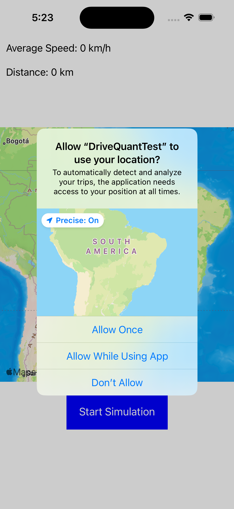
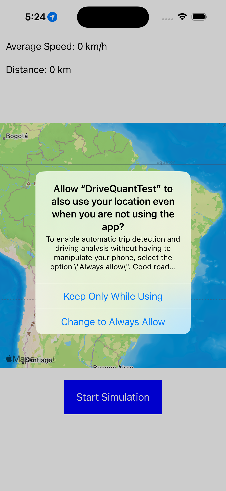
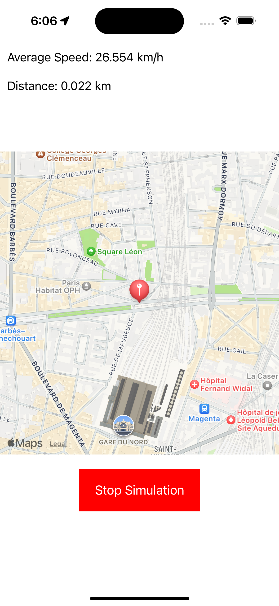

# DriveQuant Test

Before running the project, make sure to install the CocoaPods dependencies in the project folder `DriveQuantTest`. Use the following command:
```
pod install
```
And then open the `DriveQuantTest.xcworkspace`. For the application to function correctly, you must grant location permissions, make to select both "Alow While Using App" and "Change to Always Allow". Wait a few seconds, and the app will determine your position on the Map.





You can use the simulation or your own location to navigate on the map. Press the 'Start Simulation' button to begin the simulation.



## SpeedCalculator

The project uses SpeedCalculator module to calculate the average speed and the crow flies distance. To do so there are 3 available methods: 

- `calculateCrowFliesDistance(with coordinate: CLLocationCoordinate2D) -> Double` : Calculates the crow flies distance in kilometers from the start trip point based on the provided coordinate.
- `calculateAverageSpeed(with coordinate: CLLocationCoordinate2D?, date: Date) -> Double` : Calculates the average speed in kilometers per hour based on the provided coordinate and timestamp.
- `resetCalculation()`: Resets the calculation, clearing the starting coordinate and timestamp.

There are also 2 properties availables in this module:
- `currentDistance`: The current crow flies distance in kilometers calculated.
- `currentSpeed`: The current average speed in kilometers per hour calculated.